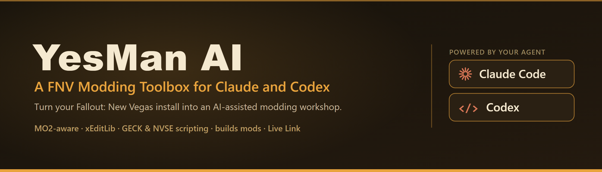
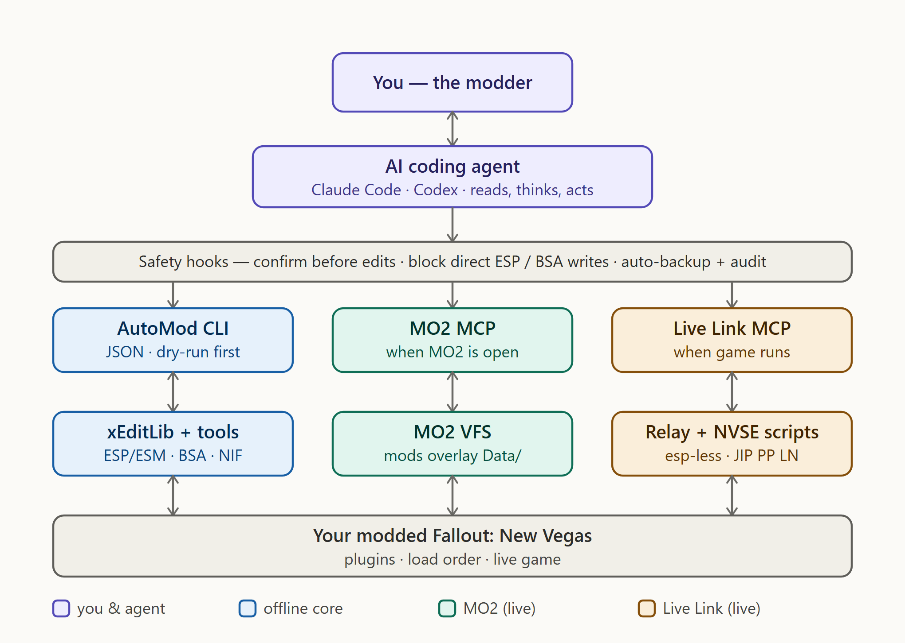

  

# YesMan AI - A FNV Modding Toolbox for Claude and Codex

Turn your Fallout: New Vegas install into an AI-assisted modding workshop. [Claude Code](https://claude.com/claude-code) or [OpenAI Codex](https://developers.openai.com/codex) becomes a modding expert that can write ESP plugins, GECK & NVSE scripts, build entire mods, debug crashes, convert FO3 mods to TTW and much more — with safety guardrails so it doesn't break your game.

> **This is a complete, ready-to-run environment**, not a guide. Run one installer, pick your Mod Organizer 2 instance, and start building. Built from the ground up for Fallout: New Vegas' engine, and for **Mod Organizer 2** setups.

## How it fits together

  

You talk to the agent; every edit passes the safety hooks; three channels — the offline **AutoMod / xEditLib** core, the **MO2 MCP** for live load-order and conflict data, and the **Live Link** to your running game — all converge on your modded install. The Live Link also carries a two-way in-game chat loop.

---

## What you get

- **A 650+ line FNV knowledgebase** (`KNOWLEDGEBASE.md`), auto-loaded every session: GECK/NVSE scripting, the MO2 virtual file system, the xNVSE stability stack, xEdit cleaning/merging/navmesh, audio (ogg/lip), NIF meshes, MCM, TTW porting, and the `.fos` save format. Every claim is confidence-tagged and sourced.
- **Reads and edits your plugins directly** — inspect what an `.esp`/`.esm` actually changes, edit its records, and diff two plugins, all programmatically via **xEditLib** (`GM_FNV=0`) and validated against real game files.
- **Writes GECK scripts _and_ native plugins** — from in-plugin GECK scripts (`SCPT`/`SCTX`, NVSE) all the way up to complete **xNVSE script-extender plugins**: with Visual Studio installed, the `build` module and `/nvse-plugin` skill scaffold the C++ and compile a working 32-bit `.dll` (validated in-game).
- **An AutoMod CLI** (`tools/automod-cli.sh`) — one JSON-emitting command over **11 modules**: `esp` (records via xEditLib), `mcm` (config-menu JSON), `bsa` (BSArch), `audio` (oggenc2 → 24kHz mono), `nif` (read + same-length retexture), `lod` (FNVLODGen/xLODGen orchestration), `fomod` (installer XML), `crashlog` (crash-log parsing), `funcs` (NVSE function index), `ini` (read-only INI audit), `build` (drives your MSVC to compile a native NVSE plugin). Auto-detects external tools; `--dry-run` on every write.
- **A `.fos` save reader** (`scripts/read-fos.js`) — extract plugin lists, search FormIDs/strings, check mod footprint. FNV saves are uncompressed, so it's pure Node, no deps.
- **18 skills** — 16 task commands, an always-on `fnv-context` that injects the top gotchas the moment you touch FNV files, and `fnv-live-link` (drives the running-game link):
  `/inspect-esp`, `/create-mod`, `/geck-scripting`, `/esp-less-mod`, `/nvse-plugin`, `/fnv-nif`, `/fnv-bsa`, `/fnv-audio`, `/fnv-mcm`, `/fnv-save`, `/fnv-lod`, `/fnv-fomod`, `/fnv-anim`, `/fnv-crashlog`, `/port-ttw`, `/patch-compat`.
- **Safety hooks** — Claude asks before editing any game file, hard-blocks direct ESP/ESM/BSA writes, and auto-backs-up everything it touches with an audit log.
- **MO2-aware** — understands that your mods live in the MO2 instance (not `Data/`) and that the real load order is the MO2 profile.
- **Included: MO2 MCP server** (`mo2-mcp/`) — a Mod Organizer 2 plugin, installed with the toolbox, that gives Claude **live** awareness of your real modded order (otherwise it sees only vanilla `Data/`). ~26 tools:
  - Cross-plugin **conflict/override analysis** — who wins each record, across your whole load order.
  - **One-command compatibility patches** (`mo2_create_patch`), dry-run first.
  - Record reading on the *modded* order, plus VFS file access and BSA/NIF/audio/DLL inspection.

  The skills use it automatically when MO2 is open, and fall back to the AutoMod CLI when it isn't.
- **Included: YesMan AI Live Link** (`live-link/`) — a real-time channel to your *running* game (**18 MCP tools**, eight esp-less GECK scripts + a stdio Python relay; no plugin DLL). Claude can:
  - **Observe** — a live 23-field player/world/quest snapshot.
  - **React** — 38 pushed event types (kills/combat, item pickups/sells/equips, aid use, location discovery, fast-travel, perks, quest/objective progress, VATS/killcam, what NPCs say to you, save/load, and more).
  - **Converse** — a two-way in-game text chat with a persistent scrollable log (press `\` to talk to Claude), plus on-screen messages back to you.
  - **Act** — run any command the player could type (`fnv_console` catch-all) or any GECK script snippet.

  Active whenever FNV is running with a save loaded (needs the NVSE stack incl. JIP PP LN). See `live-link/README.md`.

## Public tools only

YesMan AI orchestrates **publicly available tools** — xEditLib, FNVEdit/xEdit, BSArch, NifSkope, oggenc2, the GECK, LOOT, NVSE. Everything works on a standard FNV+MO2 setup, and every part of YesMan AI — including the MO2 MCP plugin and the YesMan AI Live Link — is **MIT-licensed** and installed together by the one installer. Nothing is locked behind a private service.

---

## Setup

### 1. Install the prerequisites
- **An AI coding agent** — [Claude Code](https://claude.com/claude-code) (a Claude Pro/Max subscription + the app or `npm install -g @anthropic-ai/claude-code`) and/or [OpenAI Codex](https://developers.openai.com/codex). The installer sets up whichever you pick.
- **[Node.js](https://nodejs.org/)** — for the xEditLib ESP backbone and the `.fos` save tools.
- **[Python 3](https://www.python.org/downloads/)** (tick *Add to PATH*) — for the Live Link relay and the installer's configuration step.

### 2. Run the installer
Download **`YesManAI-Setup-1.0.1.exe`** and run it. The wizard:
- **auto-detects your Fallout: New Vegas folder** (confirm or change it),
- **asks which agent to set up** — Claude Code, Codex, or both,
- **lists your Mod Organizer 2 instances** and lets you pick the one that manages this game (or choose *I don't use MO2*),
- copies the toolbox in, installs the **xEditLib backbone** (`npm install`), fills your paths into the agent's instruction file (`CLAUDE.md` / `AGENTS.md`) and the safety hooks, deploys the **MO2 MCP plugin** and the **YesMan AI Live Link**, and registers the MCP servers (in `~/.claude.json` and/or `~/.codex/config.toml`).

No zip to extract, no prompt to paste, no per-component installers — one wizard installs everything.

### 3. Restart and go
- **Restart your agent** (Claude Code and/or Codex) so it picks up the MCP servers. Codex reads the toolbox via `AGENTS.md` + `~/.codex/config.toml` (the installer marks the game folder a trusted Codex project, so its skills, hooks, and MCP config load).
- **If you use MO2:** restart it, then enable **FNV MO2 MCP Server** (Settings → Plugins) and the **YesMan AI Live Link** mod in the left pane.
- The Live Link also needs the NVSE stack incl. **JIP PP LN** — see `live-link/README.md`.
- **For the Live Link's real-time experience, ask your agent to "arm the live feed."** By default it only sees in-game events and your chat when it *polls*; arming sets up a background monitor so it reacts to events and answers your in-game chat on its own. It's per-session — re-arm it each time you start a new session.

Open your agent in your FNV folder and start modding. **That's it.**

> Advanced/manual installs can run the configurator directly: `python installer/configure.py --game-root "<FNV folder>" --agent both` (also `--mo2-instance "<MO2 folder>"` or `--no-mo2`). The `.exe` is just a wizard around it.

---

## Using it

Open your agent (Claude Code or Codex) in your FNV folder any time — the knowledgebase, hooks, and skills load automatically. Then just ask:

- *"Build me a plugin that adds a 10mm pistol with a custom reach and a fire effect."*
- *"Read MyMod.esp and tell me what it actually changes."*
- *"Write a GECK quest script that tracks kills and shows a message every 10."*
- *"This FO3 mod won't load in my TTW game — convert it."* (`/port-ttw`)
- *"These two mods both edit the same weapon — make a compatibility patch."* (`/patch-compat`)
- *"My game CTDs on startup — help me find the culprit."* (checks the xNVSE stability stack + logs)
- *"Make an MCM menu for my mod with a toggle and a slider."* (`/fnv-mcm`)
- *"What plugins does this save still reference from a mod I removed?"* (`/fnv-save`)

And with the **YesMan AI Live Link** active (the game running with a save loaded):

- *"What's my character's status right now?"* (live state: position, health, survival, gear, active quest)
- *"Give me 500 caps and set the time to noon."* (runs the commands in your live game)
- *"Tell me on-screen when I'm low on water, and react when I get into a fight."* (state + pushed events)

---

## Docs
- `docs/getting-started.md` — first session walkthrough
- `docs/automod-cli.md` — the AutoMod CLI reference (all 11 modules)
- `docs/safety-philosophy.md` — what the guardrails do and why
- `docs/xeditlib-guide.md` — the ESP backbone API
- `docs/esp-backbone-decision.md` — why xEditLib is the ESP backbone
- `mo2-mcp/README.md` — the bundled MO2 MCP server
- `live-link/README.md` — the bundled YesMan AI Live Link
- `installer/` — the Inno Setup installer + the `configure.py` configurator
- `codex/` — the Codex integration (`AGENTS.md`, `.codex/hooks`, `.agents/skills` deploy); see `codex/README.md`
- `KNOWLEDGEBASE.md` — the full reference (auto-loaded every session)

## License
MIT — see `LICENSE`.

## Credits
Created by **JmyX**. Developed with [Claude Code](https://claude.com/claude-code) (Claude Opus 4.8).

Adapted from the **Skyrim Claude Code Toolkit by WingedGuardian** ([skyrimvr-claude-toolkit](https://github.com/WingedGuardian/skyrimvr-claude-toolkit), MIT) — this is a ground-up rework for Fallout: New Vegas' engine. xEditLib via [WingedGuardian/xeditlib](https://github.com/WingedGuardian/xeditlib) (engine from xEdit/zEdit). The bundled MO2 MCP server is a Fallout: New Vegas port of **Aaronavich's MO2 MCP Server** ([Claude_MO2](https://github.com/Avick3110/Claude_MO2), MIT) — see `mo2-mcp/NOTICE.md`. The bundled YesMan AI Live Link is a re-architecture of the **SkyLink AI** concept by **Jarvann** ([SkyrimMCP](https://github.com/jarvann/SkryimMCM), MIT) onto FNV's NVSE stack — see `live-link/NOTICE.md`. FNV knowledge sourced from the GECK Wiki, xNVSE, Viva New Vegas, Tale of Two Wastelands, and the FNV modding community.
